# Unit2- Oxygen- TMetric
#### TMetric is a time tracking app that helps streamline your growing business for higher profits, satisfied clients and happier teams.

## Technologies Used
<ul>
<li>HTML
<li>CSS
<li>Javascript
</ul>

### Index Page
<ul>
<li>Overview of TMetric.
<li>TMetric offers time tracking service for freelancers and small business owners who want to optimize their business processes and increase personal productivity. TMetric tracks time spent on tasks and projects from your work flow.
</ul>
 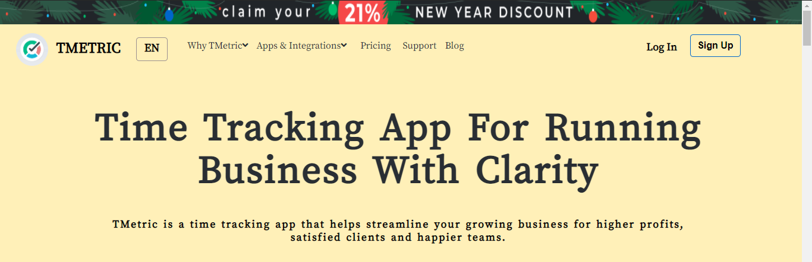
 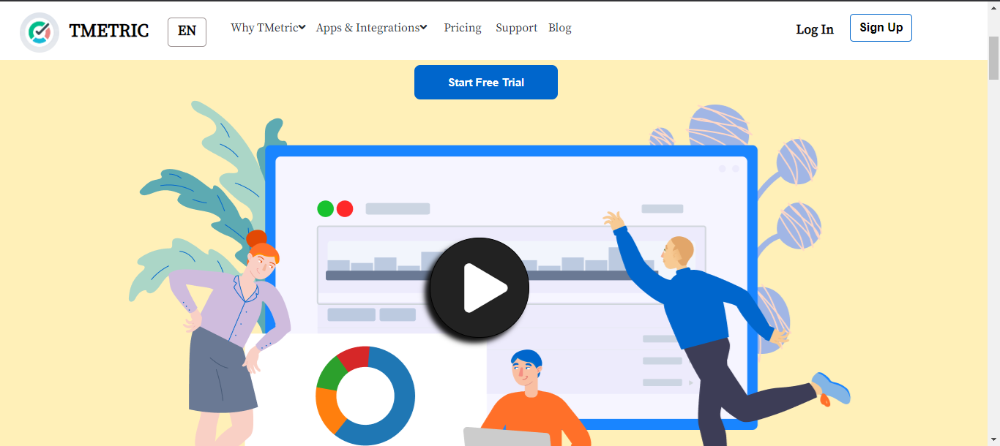
 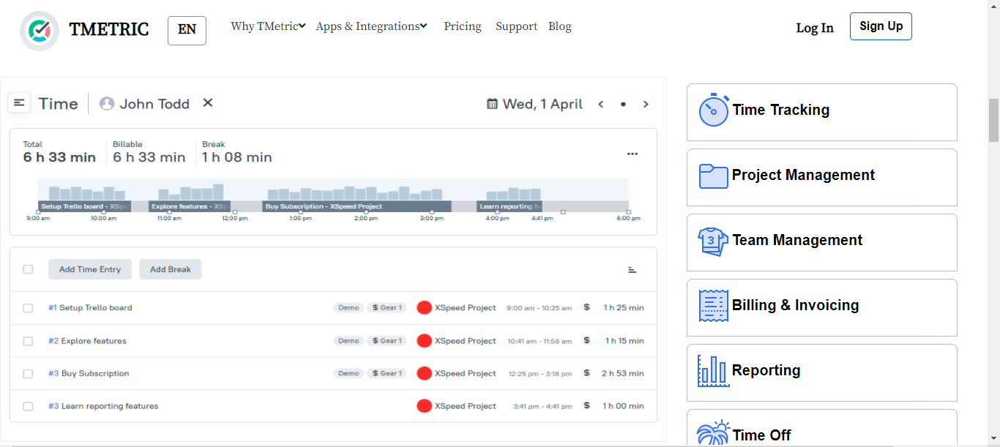
 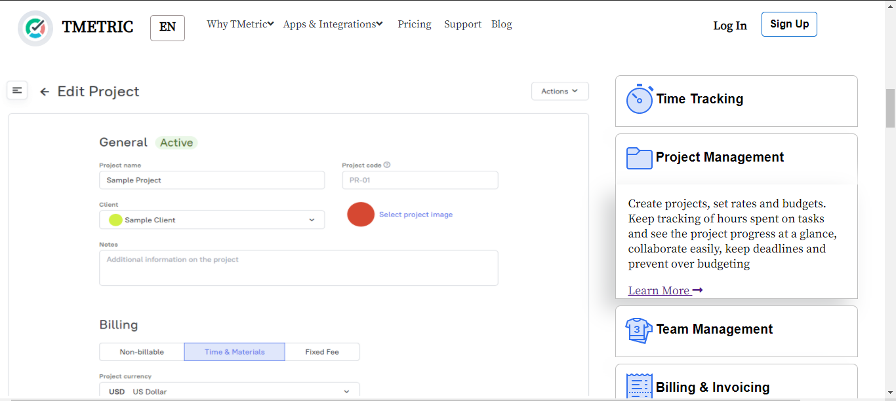
 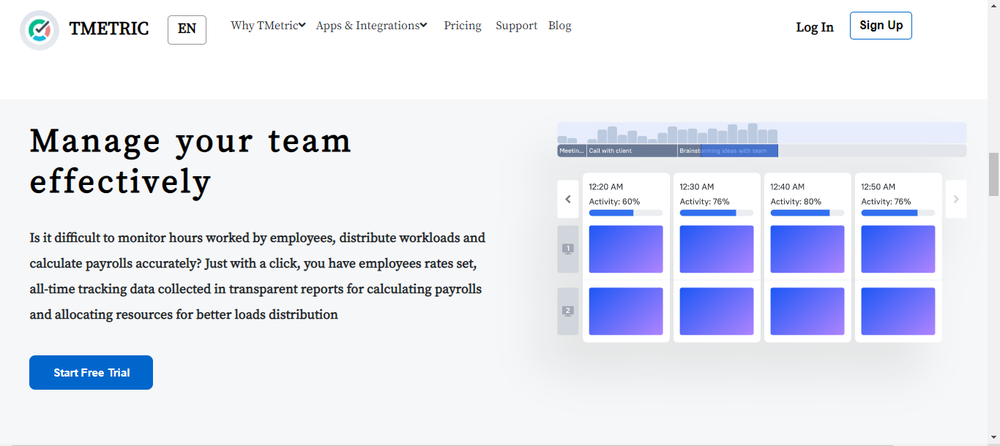
 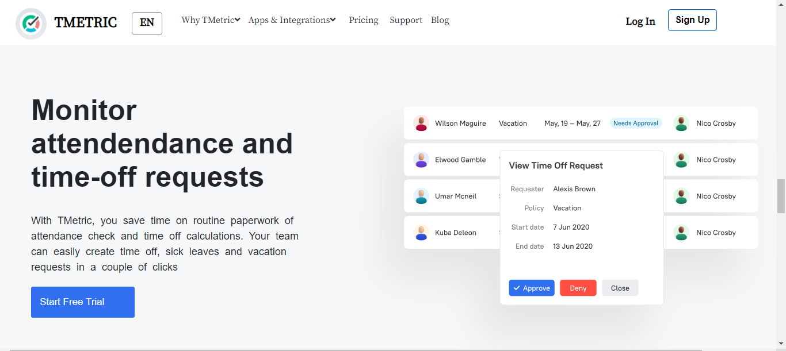
 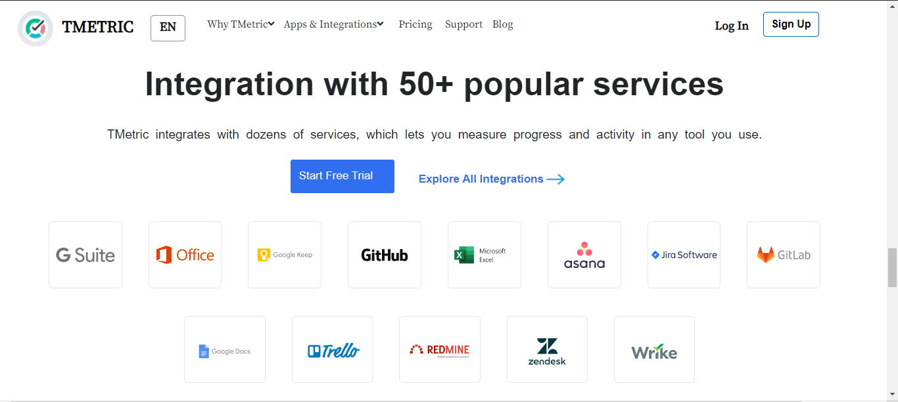
 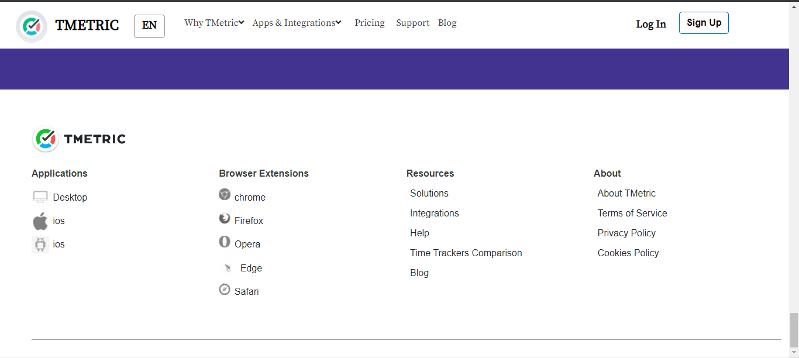
 <h1></h1>

### Login - SignUp - page
<ul>
<li> This the basic login SignUp page used to access the dashboard.
</ul>
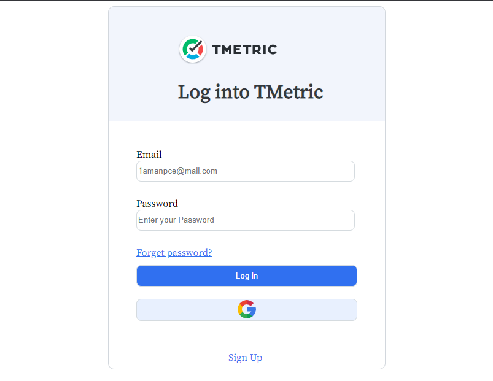
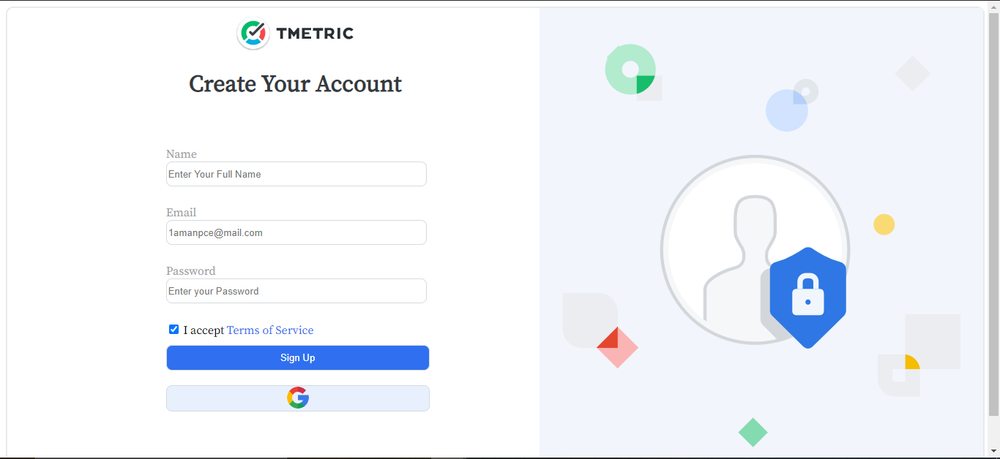
<h1></h1>

### Dashboard
#### Dashboard - Time
<ul>
<li>The default page after login is the Time page in the dashboard
<li>Dashboard has a slideable side nave bar with a collapse menu.
</ul>
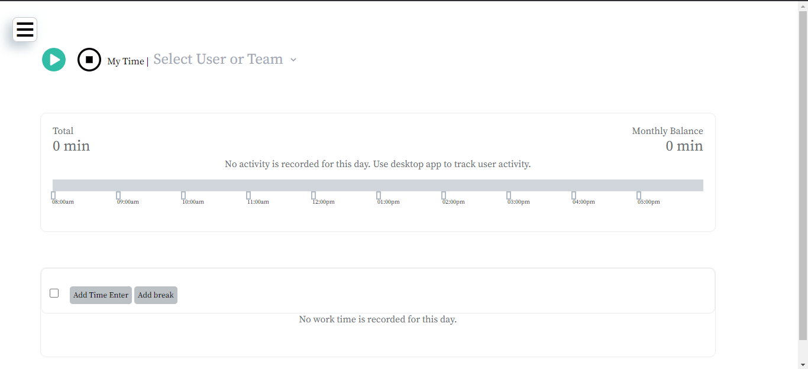
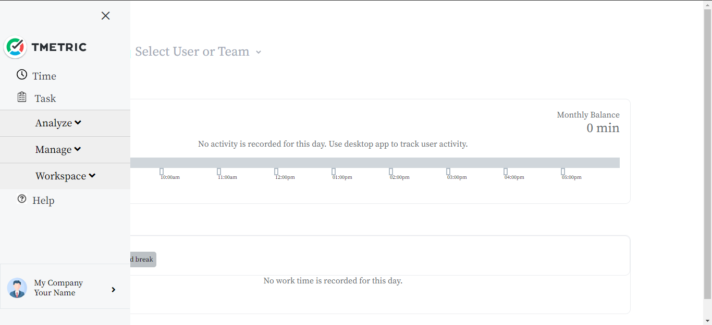
<h1></h1>

#### Dashboard - Task
<ul>
<li>My task pages is used to add or delete tasks, Every input is stored on the local storage. Asn is retrived or removed from local storage when needed.
<li>My task pages have multiple drop down menus which is used to select/filter data according to the needs.
</ul>
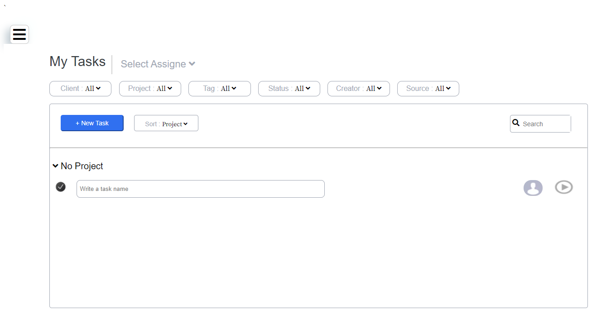
<h1></h1>

#### Dashboard - My Activity
<ul>
<li>My Activity page displays the data for the whole day. It shows amount of time worked on a project, break time and total productive hours in a day.
</ul>

<h1></h1>

#### Dashboard - Projects
<ul>
<li>Projects page displays the active projects in the dashboard. This page has multiple dropdown button and a toggle switch to get the required projects.
<li>This page also has a button which allows us to add a new project in the dashboard
</ul>
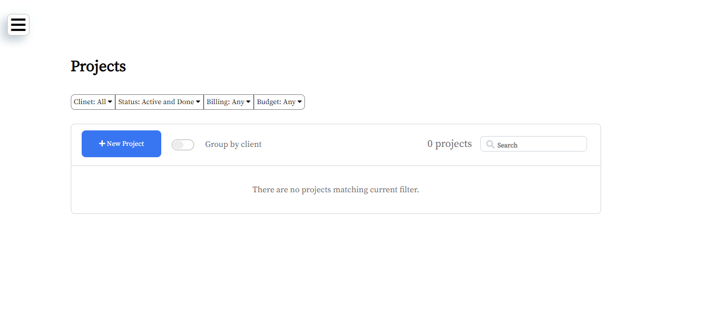
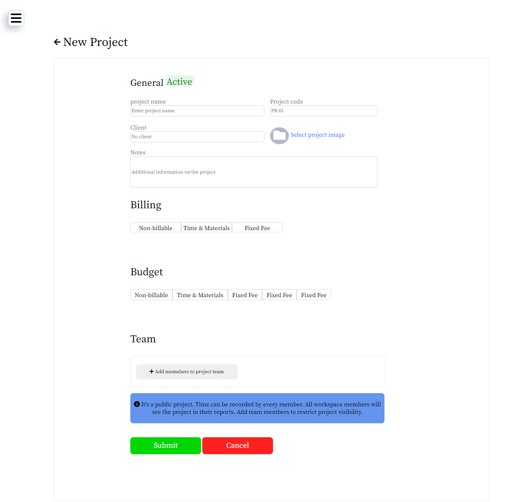
<h1></h1>

#### Dashboard - Clients
<ul>
<li>Clients page displays the client details in the dashboard.
<li>This page also has a button which allows us to add a new clinet in the dashboard
</ul>
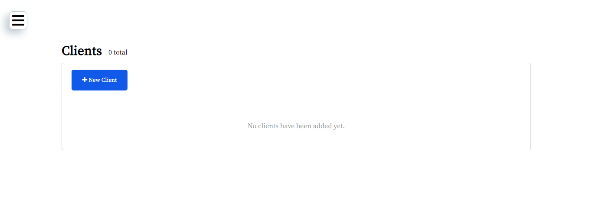
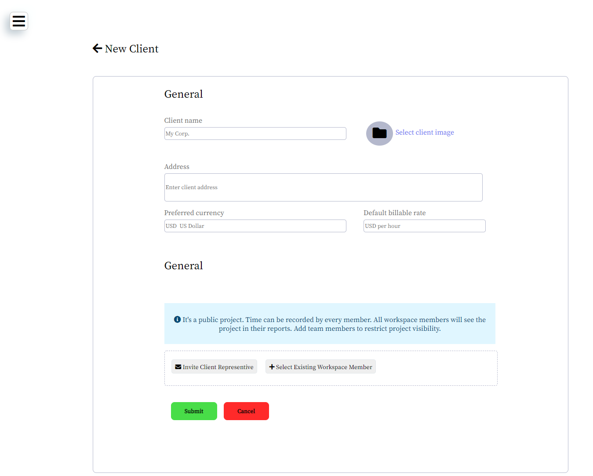
<h1></h1>

#### Dashboard - Inovice
<ul>
<li>Invoice page displays the pay according to the projects or clients. We have a button in this page which we can use to create a new invoice for the client.
</ul>
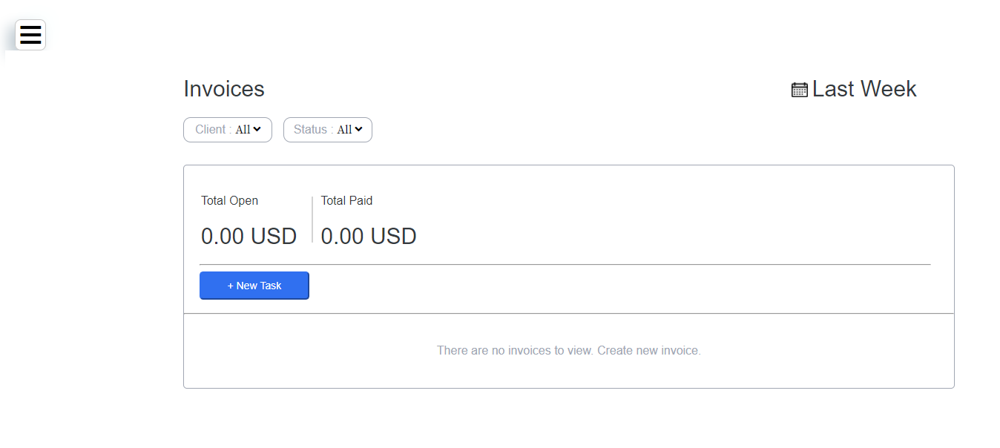
<h1></h1>

#### Dashboard - Profile Details
<ul>
<li>This feature is located at the bottom of the side navigation bar. When we click on it, It will display an pop-up menu which My Profile, My Company, My Workspace and
  a logout page. 
<li>My Profile and My Company page is used to edit the profile and company details.
</ul>
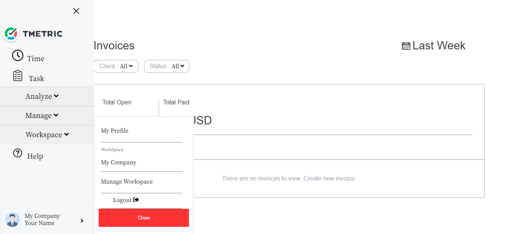

<h1></h1>

 👤 Vinesh Nair
 <ul>
 <li>Github : Vinesh3124
 <li>Email : vinesh.nair31@gmail.com
 </ul>

 <h1></h1>
 

 👤 Thulasi Vadde
 <ul>
 <li>Github : ThulasiVadde
 <li>Email : 
 </ul>

<h1></h1>

 👤 Amanullah
 <ul>
 <li>Github : Amanullah21
 <li>Email : 
 </ul>

